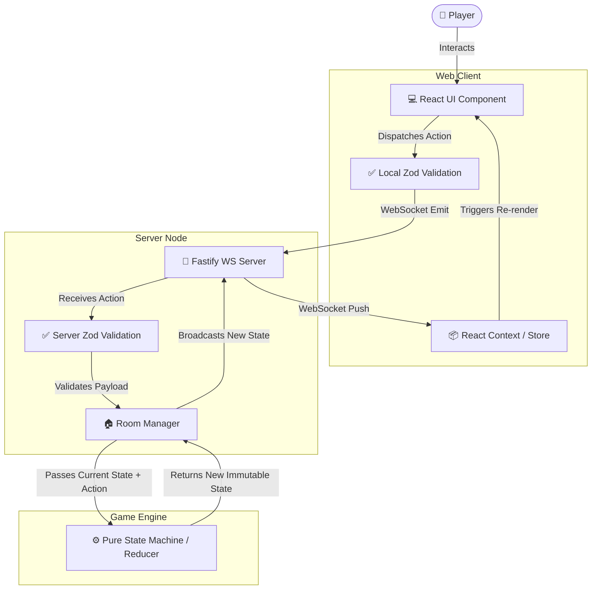

# 🚀 Universal Multiplayer Board Game Platform

[](./LICENSE)


A modular, real-time, multiplayer board game platform that plays classic board games over the web. The project is a **TypeScript monorepo** combining a **React + Vite** web client, a **Fastify + WebSocket** server, and a set of dependency-free, **pure functional game engines** (one per game).

Games currently implemented:
- 🎩 **Monopoly** — complete ruleset: property management, trading, jail, bankruptcy, Chance/Community Chest cards. (2–8 players)
- 🐑 **Catan** — hex-grid building with official two-round initial placement, resource management, maritime trading, robber, development cards, awards, win conditions. (3–4 players)
- 🕵️ **Scotland Yard** — hidden movement on a London map graph, ticket tracking, and Mr. X reveal mechanics, including a shared-board hot-seat mode where Mr. X's location stays hidden from detectives until a reveal turn. (3–6 players)

---

## ✨ Highlights

- **Pure, deterministic game engines** — each engine is an immutable state machine (a `reducer(state, action)`), making gameplay rules fully unit-testable and free of hidden side effects.
- **Real-time multiplayer** — WebSocket-driven rooms with crypto-random room IDs and per-session tokens to keep connections secure. Both **online** (join rooms by ID from another machine) and **local hot-seat** are supported; hot-seat rooms flag the owner session, which drives any seat on the shared board while online joiners stay strictly bound to their own identity (see [FIXES.md](./FIXES.md) and [ARCHITECTURE.md](./docs/ARCHITECTURE.md) §5.3).
- **Per-game player rules** — the Lobby's player selector adapts to each game's official range (Monopoly 2–8, Catan 3–4, Scotland Yard 3–6), enforced at both the server and engine layers.
- **Defense in depth validation** — the same Zod schemas validate every action on both the client *and* the server.
- **Polish** — a rich React UI with contextual HUDs, animated tokens, procedural Web Audio sound effects, and a live event log.
- **Performance-conscious UI** — the three game rooms are code-split via `React.lazy` + `Suspense` (users only download the game they pick), Vite `manualChunks` isolate `react`/`react-dom` and the Scotland-Yard-only zoom library into cached vendor chunks, and the boards are memoized so heavy static layers (e.g. Scotland Yard's 199-node graph) never re-render on every state update (Phase 34).
- **Fully CI-backed** — GitHub Actions runs typecheck, lint, the full test suite, and production builds on every push/PR.

---

## 🚀 Quick Start

> **Prerequisites:** [Node.js](https://nodejs.org/) `>= 20` and **npm**.

```bash
# 1. Clone the repository
git clone <your-repo-url> && cd BoardGameServer

# 2. Install every package from the root (npm workspaces)
npm install

# 3. Start the game server (Fastify, watch mode) -> http://localhost:3000
npm run dev --workspace @packages/server

# 4. In a second terminal, start the web client (Vite) -> http://localhost:5173
npm run dev --workspace web-client
```

Open the web client URL, create a room, share the link/room ID with friends, and play!

### Useful Scripts

| Command | Description |
| --- | --- |
| `npm test` | Run the full Vitest suite (engines + server + client). |
| `npm run test:cov` | Run the test suite with coverage report. |
| `npm run typecheck` | Type-check all packages (root TS 5.x + client TS 6.x). |
| `npm run lint` | Lint engines + server via root `oxlint`. |
| `npm run dev --workspace @packages/server` | Start the Fastify server in watch mode (`tsx`). |
| `npm run dev --workspace web-client` | Start the Vite dev client on `http://localhost:5173`. |
| `npm start` (in `packages/server`) | Run the compiled server on `http://127.0.0.1:3000`. |

---

## 📁 Repository Structure

```
BoardGameServer/
├── packages/
│   ├── engine-core/            # Shared interfaces for the pure state machines
│   ├── monopoly-engine/        # Monopoly rules engine
│   ├── catan-engine/           # Catan rules engine
│   ├── scotland-yard-engine/   # Scotland Yard rules engine
│   ├── server/                 # Fastify + WebSocket multiplayer server
│   └── web-client/             # React + Vite + Tailwind frontend
├── .github/workflows/          # CI pipeline (typecheck, lint, test, build)
├── package.json                # npm workspace root
└── vitest.workspace.ts         # Vitest workspace definition
```

---

## 🗺️ Architecture

> **Full deep-dive:** every nitty-gritty detail of the engines, server, client, hidden-information rules, persistence, and containerization is documented in [**`docs/ARCHITECTURE.md`**](./docs/ARCHITECTURE.md).

The platform is designed around strict, immutable, pure functional state machines for game engines, ensuring deterministic gameplay and 100% testability.

### Game & UI Data Flow

The following flowchart illustrates the lifecycle of a player action, from the UI through the network to the pure game engine, and back to the UI.



### 🔄 Step-by-Step Code Flow

1. **User Interaction (`@packages/web-client`)**: A player clicks a button (e.g., "Roll Dice"). The React component dispatches a predefined action object.
2. **Action Validation (Client-Side)**: Before sending, the client uses `zod` schemas to ensure the action payload is well-formed.
3. **Network Transport (`@packages/server`)**: The client emits a WebSocket event containing the action to the Fastify server.
4. **Server Validation**: The Fastify server receives the payload and re-validates it using the identical `zod` schemas to prevent malicious or malformed requests.
5. **Game Engine Processing (`@packages/*-engine`)**: The server passes the current game state and the validated action to the game engine's pure reducer function (e.g., `MonopolyEngine.reducer(state, action)`).
6. **Immutable State Update**: The pure reducer calculates the next state based on the game rules and returns a completely new, immutable state object. It *never* mutates the old state.
7. **Broadcast**: The server updates the room's current state and broadcasts this new state to all connected clients in the room via WebSockets.
8. **UI Re-render (`@packages/web-client`)**: The React application receives the new state, updates the global context/store, and triggers a re-render of the UI to reflect the new game reality (e.g., moving the player's token on the board).

### 💾 Room Snapshotting & "Rehydration"

Game rooms live in the server's memory as `Room` instances (held by `RoomManager`). To survive crashes and restarts, every change to a room is snapshotted into Redis (`room:<id>` key) by `Room.saveState()`.

**"Rehydrating a room"** means restoring one of those snapshots back into live memory. On server boot, `RoomManager.initFromRedis()` reads every `room:*` key and rebuilds the `Room` objects from the JSON snapshots — restoring the exact game state, player connections, session tokens, and timers:

```
Room (in-memory)  ──saveState()──▶  Redis snapshot  ──initFromRedis()──▶  Room (in-memory)
  (live game)                        (crash-safe)                     "rehydrated" on boot
```

The client/server log line `Rehydrated room <id> from Redis` simply means *"a game that existed before the restart was reloaded from Redis and is live again"* — so players reconnect to the same game instead of losing it. If a snapshot can't be restored it is logged as `Failed to parse room` (a real bug here was fixed: rehydration used to throw on an empty player list; see `FIXES.md`).

### Packages
- `@packages/engine-core`: Shared interfaces (`IGameEngine`, `IGameState`, `IPlayerAction`) defining the pure state machine boundaries.
- `@packages/monopoly-engine`: Complete Monopoly ruleset with property management, trading, dice logic, jail rules, bankruptcy, and Chance/Community chest cards.
- `@packages/catan-engine`: Resource management, hex grid coordinate systems, building, maritime trade, robber mechanics, development cards, awards, and win conditions.
- `@packages/scotland-yard-engine`: Graph-based map navigation, hidden movement, ticket management, and Mr. X reveal mechanics.
- `@packages/server`: A Fastify + WebSocket (`@fastify/websocket`) server with robust Zod validation for room and game state synchronization.
- `@packages/web-client`: The frontend React application built with Vite and Tailwind CSS. Features highly interactive UIs, smooth CSS animations, floating event logs, Web Audio API sound effects, and robust optimistic state updates.

## ⚙️ Note on TypeScript Versions
This project uses different TypeScript versions in different packages intentionally:
- The root project and engine packages use `typescript@^5.3.3`.
- The `web-client` package uses `typescript@~6.0.2`. This is required for Vite 8 compatibility.

## 🛠️ Features
- **Real-Time Multiplayer**: WebSocket synchronization for instant action reflection, secured per-room session tokens (crypto-random room IDs + token-verified connections).
- **State Persistence & Resilience**: Built-in Redis support for server crash-recovery, HTTP rate limiting, Token-Bucket WebSocket throttling, and Ping/Pong heartbeat disconnect/forfeit management.
- **Turn Timer / AFK Management**: optional per-room countdown (`TURN_TIME_LIMIT_MS`) with automatic `FORCE_END_TURN` / `SKIP_TURN` auto-forfeit across all three games, enforced by the server's turn timer and driven by Monopoly's `LOBBY → IN_PROGRESS` state transition, with a live `TurnTimer` countdown widget in every room (Phase 33).
- **Strict Validation**: Zod schemas used to validate every action both on the server and client.
- **Audio & Visual Polish**: Procedural Web Audio effects, dynamic 3D CSS dice rolls, and animated tokens.
- **Interactive UI**: Rich contextual HUDs, robust trading modals, property management interfaces, and a dynamic event log.
- **TDD Backed**: Comprehensive test suites for game engines guaranteeing rule enforcement (e.g., Monopoly's complex edge cases like debt collection and even-build rules).
- **Optimized & Pure Engine**: Deterministic pure state machines with shallow cloning for ultra-fast, garbage-collection-friendly game loop performance.
- **CI/CD**: GitHub Actions workflow running typecheck, lint, the full test suite, and both production builds on every push/PR.

## 🚀 Development & Tooling

Workspace is an npm monorepo; install once from the root with `npm install`. See the [Quick Start](#quick-start) table above for common commands.

The server binds `http://localhost:3000`, serves CORS only to the Vite dev client (`localhost:5173`), and requires a valid `?playerId=` + `token=` pair for every WebSocket room connection.

## 🚀 Production Deployment (single VPS, git-push triggered)

This project is built to run as a **single Docker Compose stack on one VPS/VM** (server + client + Redis). There's a GitHub Actions workflow (`.github/workflows/deploy.yml`) that **re-deploys automatically on every push to `main`** — no Vercel/serverless needed.

> ⚠️ A note on hosting: a real-time, stateful WebSocket game cannot run on Vercel's stateless serverless functions. A single VPS running Docker is the correct target. The full CI pipeline (`.github/workflows/ci.yml`) runs typecheck, lint, tests, and both production builds on every push before the deploy workflow runs.

### One-time VPS bootstrap

On a fresh Ubuntu-ish VPS (Node/Docker not strictly required — the images are self-contained, but Docker + Compose are):

```bash
# 1. Install Docker Engine + Compose plugin, then:
sudo usermod -aG docker $USER && exec su -l $USER   # re-login for docker group

# 2. Deploy dir (must match DEPLOY_DIR in the workflow — default /opt/board-game-server)
sudo mkdir -p /opt/board-game-server && sudo chown $USER /opt/board-game-server

# 3. Create the production env file (values below; see .env.production.example)
#    Copy it now — git clone needs it before first `docker compose up`.
vi /opt/board-game-server/.env
```

The `.env` (not tracked in git) overrides the compose defaults:

```env
CLIENT_ORIGIN=https://games.example.com
CLIENT_API_URL=https://api.example.com
```

### GitHub secrets (for the deploy workflow)

Add these repo **Actions secrets** (Settings → Secrets and variables → Actions):

| Secret | Purpose |
| --- | --- |
| `VPS_HOST` | Public IP / hostname of the VPS. |
| `VPS_USER` | SSH username (the non-root user in the `docker` group). |
| `VPS_SSH_KEY` | Private SSH key (RSA/Ed25519) authorized on the VPS. |
| `VPS_PORT` | *(optional)* SSH port, default `22`. |

### How each deploy runs

On push to `main` (CI and deploy run concurrently), the deploy workflow SSHes in and:
1. Clones/pulls the repo into `/opt/board-game-server` (via `git reset --hard origin/main`).
2. Loads your server-side `.env`.
3. Runs `docker compose up -d --build` — rebuilds only changed layers (fast incremental rebuilds), starts Redis + server + client, and persists game state in the `redis-data` volume.
4. Prunes dangling images to keep disk clean.

> To make deploys wait for CI to pass first, enable **branch protection → "Require status checks"** on `main` for the `CI` workflow. Since only passing code merges to `main`, the push-triggered deploy then only ever ships verified code.

### TLS / reverse proxy (recommended for HTTPS)

The compose stack serves plain HTTP (`:3000` server, `:5173` client). For production use a reverse proxy (nginx/caddy/traefik) in front to terminate TLS and forward to the containers. If you add the proxy, set `CLIENT_ORIGIN`/`CLIENT_API_URL` to the public HTTPS URLs and make sure the proxy forwards WebSocket `Upgrade` headers to the server port.

---

## 🧭 Engineering Docs

- **[ARCHITECTURE.md](./docs/ARCHITECTURE.md)** — Full architecture deep-dive: engine contracts, per-game engine rules, server internals (rooms/sessions/Redis/rehydration), WebSocket protocol, client UI/animation pipeline, hidden-information enforcement, containerization, and known limitations.
- **[FIXES.md](./FIXES.md)** — Identified bugs, planned improvements, and implementation diffs.
- **[COVERAGE.md](./COVERAGE.md)** — Test coverage matrix for all components.
- **[PROJECT_TRACKER.md](./PROJECT_TRACKER.md)** — High-level roadmap, phase-by-phase implementation status, and completion state.

## 📄 License

This project is licensed under the GPL-3.0 License. See the [LICENSE](./LICENSE) file for details.
